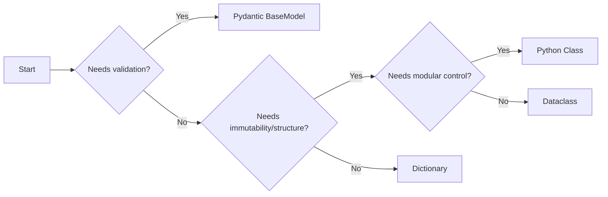

# Python Code Smells

<div class="abs-br m-6 text-xl">
  <button @click="$slidev.nav.openInEditor" title="Open in Editor" class="slidev-icon-btn">
    <carbon:edit />
  </button>
  <a href="https://github.com/slidevjs/slidev" target="_blank" class="slidev-icon-btn">
    <carbon:logo-github />
  </a>
</div>

<!--
The last comment block of each slide will be treated as slide notes. It will be visible and editable in Presenter Mode along with the slide. [Read more in the docs](https://sli.dev/guide/syntax.html#notes)
-->

---
layout: cover
transition: fade-out
---

# Part 1: Clean code

---
transition: fade-out
level: 2
---

# What is clean code?

 - ✨ Readable – Code should be easy to read and understand at a glance.
 - 📏 Consistent – Follows a uniform style throughout the codebase.
 - 🎯 Focused – Each function, class, and module should have a single responsibility.
 - 🔍 Self-documenting – Uses meaningful names and clear logic, reducing the need for comments.
 - 🏗️ Well-structured – Organized logically, with small, cohesive components.
 - 📦 Minimal dependencies – Avoids unnecessary coupling between components.
 - 🚀 Efficient – Written to perform well without premature optimization.
 - 🛠️ Easily maintainable – Designed for future changes with minimal impact.
 - ❌ Avoids duplication – Follows DRY (Don’t Repeat Yourself) principles.
 - 🔄 Encapsulated – Keeps details hidden and exposes only what’s necessary.
 - 🎭 Expresses intent clearly – Shows what it does, not just how it does it.
 - 📜 Follows SOLID principles – Ensures flexibility and robustness in design.
 - 🧩 Minimizes side effects – Keeps functions pure when possible.
 - 🏎️ Simple over clever – Prioritizes clarity over smart but unreadable solutions.


---
transition: fade-out
level: 2
---

# What is clean code?

 - 🛠️ Easily maintainable – Designed for future changes with minimal impact.

---
layout: cover
transition: fade-out
---

# Part 2: Code smell

---
transition: fade-out
level: 2
---

# What is a code smell?

A surface-level indicator in the source code that suggests deeper problems in maintainability.


<div v-click>
```python
    for fq in query_filters:
        # NOTE: checking for nested filter received from FE
        if "any" in fq:
            fq = fq["any"]
            if len(fq) < 1:
                continue
            else:
                fq = fq[0]

        solr_field = fe_solr_map[fq['field']]

        if fq['type'] == 'range_field':
            if fq['field'] == 'nested_properties.units':
                print("ENTERED nested units field range:", fq['selectedRange'])
                for filter_value in fq['selectedRange']:
                    lower_selected_condition = "(value.upper_bound:[{0} TO *])".format(
                        filter_value["from"])
                    upper_selected_condition = "(value.lower_bound:[* TO {0}])".format(
                        filter_value["to"])
                    # NOTE: filter on props_.ppi.id intentionally as parent ppi ids may or may not have different units and will cause double counting if different units
                    ppi_condition = "mprops_ppi.id:({0})".format(filter_value["value"])
```
</div>


---
transition: fade-out
layout: cover
---

# Part 3: Refactoring Exercise


---
class: px-20
---

# Refactoring exercise

````md magic-move {lines: true}
```python
# Rule of thumb 1: Always type your code

def get_hof_and_gt_users(users):
    hof_users = []
    gt_users = []

    for u in users:
    # Optimization: only have to loop through all users once
        if u.get("user_id") is not None:
            uid = u.get("user_id")
            stats = get_user_statistics(user_statistics)
            ks = stats.get("kill_streak") 
            if ks is not None 
              if ks >= 100: # 100 is the criteion for hof
                  hof_users.append(uid)
              if ks >= 25: # 25 is the criteion for gt
                  gt_users.append(uid)
    return hof_users, gt_users
```
```python
# Rule of thumb 1: Always type your code

def get_hof_and_gt_users(users: list[dict]) -> tuple[list[int], list[int]]:
    hof_users: list[int] = []
    gt_users: list[int] = []

    for u in users:
    # Optimization: only have to loop through all users once
        if u.get("user_id") is not None:
            uid = u.get("user_id")
            stats = get_user_statistics(user_statistics)
            ks = stats.get("kill_streak") 
            if ks is not None 
              if ks >= 100: # 100 is the criteion for hof
                  hof_users.append(uid)
              if ks >= 25: # 25 is the criteion for gt
                  gt_users.append(uid)
    return hof_users, gt_users
```
```python
# Rule of thumb 2: Avoid abbreviations

def get_hof_and_gt_users(users: list[dict]) -> tuple[list[int], list[int]]:
    hof_users: list[int] = []
    gt_users: list[int] = []

    for u in users:
    # Optimization: only have to loop through all users once
        if u.get("user_id") is not None:
            uid = u.get("user_id")
            stats = get_user_statistics(user_statistics)
            ks = stats.get("kill_streak") 
            if ks is not None 
              if ks >= 100: # 100 is the criteion for hof
                  hof_users.append(uid)
              if ks >= 25: # 25 is the criteion for gt
                  gt_users.append(uid)
    return hof_users, gt_users
```
```python
# Rule of thumb 2: Avoid abbreviations

def get_hall_of_fame_users_and_gold_tier_users(users: list[dict]) -> tuple[list[int], list[int]]:
    hall_of_fame_users: list[int] = []
    gold_tier_users: list[int] = []

    for user in users:
    # Optimization: only have to loop through all users once
        if user.get("user_id") is not None:
            user_id = user.get("user_id")
            user_statistics = get_user_statistics(user_statistics)
            kill_streak = user_statistics.get("kill_streak") 
            if kill_streak is not None 
              if kill_streak >= 100: 
                  # 100 is the criteion for hall of fame
                  hall_of_fame_users.append(user_id)
              if kill_streak >= 25:
                  # 25 is the criteion for gold tier
                  gold_tier_users.append(user_id)
    return hall_of_fame_users, gold_tier_users
```

```python
# Rule of thumb 3: If your function contains the word "and", or your function returns a tuple,  
# your function is likely violating the single responsibility principle. 
# Break your function up into many functions

def get_hall_of_fame_users_and_gold_tier_users(users: list[dict]) -> tuple[list[int], list[int]]:
    hall_of_fame_users: list[int] = []
    gold_tier_users: list[int] = []

    for user in users:
    # Optimization: only have to loop through all users once
        if user.get("user_id") is not None:
            user_id = user.get("user_id")
            user_statistics = get_user_statistics(user_statistics)
            kill_streak = user_statistics.get("kill_streak") 
            if kill_streak is not None 
                if kill_streak >= 100: 
                    # 100 is the criteion for hall of fame
                    hall_of_fame_users.append(user_id)
                if kill_streak >= 25:
                    # 25 is the criteion for gold tier
                    gold_tier_users.append(user_id)
    return hall_of_fame_users, gold_tier_users
```

```python
# Rule of thumb 3: If your function contains the word "and", or your function returns a tuple,  
# your function is likely violating the single responsibility principle. 
# Break your function up into many functions

def get_hall_of_fame_users(users: list[dict]) -> list[int]:
    hall_of_fame_users: list[int] = []

    for user in users:
        if user.get("user_id") is not None:
            user_id = user.get("user_id")
            user_statistics = get_user_statistics(user_statistics)
            kill_streak = user_statistics.get("kill_streak") 
            if kill_streak is not None 
                if kill_streak >= 100: 
                    # 100 is the criteion for hall of fame
                    hall_of_fame_users.append(user_id)
    return hall_of_fame_users

def get_gold_tier_users(users: list[dict]) -> list[int]:
  ...
```

```python
# Rule of thumb 4: Magic numbers can typically be refactored into constants

def get_hall_of_fame_users(users: list[dict]) -> list[int]:
    hall_of_fame_users: list[int] = []

    for user in users:
        if user.get("user_id") is not None:
            user_id = user.get("user_id")
            user_statistics = get_user_statistics(user_statistics)
            kill_streak = user_statistics.get("kill_streak") 
            if kill_streak is not None 
                if kill_streak >= 100: 
                    # 100 is the criteion for hall of fame
                    hall_of_fame_users.append(user_id)
    return hall_of_fame_users

def get_gold_tier_users(users: list[dict]) -> list[int]:
  ...
```

```python
# Rule of thumb 4: Magic numbers can typically be refactored into constants

HALL_OF_FAME_KILL_STREAK_CRITERION = 100


def get_hall_of_fame_users(users: list[dict], kill_streak_criterion: int = HALL_OF_FAME_KILL_STREAK_CRITERION) -> list[int]:
    hall_of_fame_users: list[int] = []

    for user in users:
        if user.get("user_id") is not None:
            user_id = user.get("user_id")
            user_statistics = get_user_statistics(user_statistics)
            kill_streak = user_statistics.get("kill_streak") 
            if kill_streak is not None:
                if kill_streak >= kill_streak_criterion: 
                    # 100 is the criteion for hall of fame
                    hall_of_fame_users.append(user_id)
    return hall_of_fame_users

def get_gold_tier_users(users: list[dict]) -> list[int]:
  ...
```

```python
# Rule of thumb 5: As far as possible, your code should be self-commenting
# Remove unneccesary comments

HALL_OF_FAME_KILL_STREAK_CRITERION = 100


def get_hall_of_fame_users(users: list[dict], kill_streak_criterion: int = HALL_OF_FAME_KILL_STREAK_CRITERION) -> list[int]:
    hall_of_fame_users: list[int] = []

    for user in users:
        if user.get("user_id") is not None:
            user_id = user.get("user_id")
            user_statistics = get_user_statistics(user_statistics)
            kill_streak = user_statistics.get("kill_streak") 
            if kill_streak is not None:
                if kill_streak >= kill_streak_criterion: 
                    # 100 is the criteion for hall of fame
                    hall_of_fame_users.append(user_id)
    return hall_of_fame_users

def get_gold_tier_users(users: list[dict]) -> list[int]:
  ...
```
```python
# Rule of thumb 6: As far as possible, your code should be self-commenting
# Remove unneccesary comments

HALL_OF_FAME_KILL_STREAK_CRITERION = 100


def get_hall_of_fame_users(users: list[dict], kill_streak_criterion: int = HALL_OF_FAME_KILL_STREAK_CRITERION) -> list[int]:
    hall_of_fame_users: list[int] = []

    for user in users:
        if user.get("user_id") is not None:
            user_id = user.get("user_id")
            user_statistics = get_user_statistics(user_statistics)
            kill_streak = user_statistics.get("kill_streak") 
            if kill_streak is not None:
                if kill_streak >= kill_streak_criterion: 
                    hall_of_fame_users.append(user_id)
    return hall_of_fame_users

def get_gold_tier_users(users: list[dict], kill_streak_criterion: int) -> list[int]:
  ...
```

```python
# Rule of thumb 7: Avoid nesting code by using early termination

HALL_OF_FAME_KILL_STREAK_CRITERION = 100


def get_hall_of_fame_users(users: list[dict], kill_streak_criterion: int = HALL_OF_FAME_KILL_STREAK_CRITERION) -> list[int]:
    hall_of_fame_users: list[int] = []

    for user in users:
        if user.get("user_id") is not None:
            user_id = user.get("user_id")
            user_statistics = get_user_statistics(user_statistics)
            kill_streak = user_statistics.get("kill_streak") 
            if kill_streak is not None:
                if kill_streak >= kill_streak_criterion: 
                    hall_of_fame_users.append(user_id)
    return hall_of_fame_users
```

```python
# Rule of thumb 7: Avoid nesting code by using early termination

HALL_OF_FAME_KILL_STREAK_CRITERION = 100


def get_hall_of_fame_users(users: list[dict], kill_streak_criterion: int = HALL_OF_FAME_KILL_STREAK_CRITERION) -> list[int]:
    hall_of_fame_users: list[int] = []

    for user in users:
        if user.get("user_id") is None:
            continue
        user_id = user.get("user_id")
        user_statistics = get_user_statistics(user_statistics)
        kill_streak = user_statistics.get("kill_streak") 
        if kill_streak is None:
            continue
        if kill_streak <= kill_streak_criterion:
            continue
        hall_of_fame_users.append(user_id)
    return hall_of_fame_users
```

```python
# Rule of thumb 8: Use whitespace to group logical statements together to improve readability

HALL_OF_FAME_KILL_STREAK_CRITERION = 100


def get_hall_of_fame_users(users: list[dict], kill_streak_criterion: int = HALL_OF_FAME_KILL_STREAK_CRITERION) -> list[int]:
    hall_of_fame_users: list[int] = []

    for user in users:
        if user.get("user_id") is None:
            continue
        user_id = user.get("user_id")
        user_statistics = get_user_statistics(user_statistics)
        kill_streak = user_statistics.get("kill_streak") 
        if kill_streak is None:
            continue
        if kill_streak <= kill_streak_criterion:
            continue
        hall_of_fame_users.append(user_id)
    return hall_of_fame_users
```

```python
# Rule of thumb 8: Use whitespace to group logical statements together to improve readability

HALL_OF_FAME_KILL_STREAK_CRITERION = 100


def get_hall_of_fame_users(users: list[dict], kill_streak_criterion: int = HALL_OF_FAME_KILL_STREAK_CRITERION) -> list[int]:
    hall_of_fame_users: list[int] = []

    for user in users:
        if user.get("user_id") is None:
            continue
        user_id = user.get("user_id")
        user_statistics = get_user_statistics(user_statistics)
        kill_streak = user_statistics.get("kill_streak") 

        if kill_streak is None:
            continue
        if kill_streak <= kill_streak_criterion:
            continue

        hall_of_fame_users.append(user_id)
    return hall_of_fame_users
```

```python
# Rule of thumb 9: Ensure that your function does what it says it does

HALL_OF_FAME_KILL_STREAK_CRITERION = 100


def get_hall_of_fame_users(users: list[dict], kill_streak_criterion: int = HALL_OF_FAME_KILL_STREAK_CRITERION) -> list[int]:
    hall_of_fame_users: list[int] = []

    for user in users:
        if user.get("user_id") is None:
            continue
        user_id = user.get("user_id")
        user_statistics = get_user_statistics(user_statistics)
        kill_streak = user_statistics.get("kill_streak") 

        if kill_streak is None:
            continue
        if kill_streak <= kill_streak_criterion:
            continue

        hall_of_fame_users.append(user_id)
    return hall_of_fame_users
```

```python
# Rule of thumb 9: Ensure that your function does what it says it does

HALL_OF_FAME_KILL_STREAK_CRITERION = 100


def get_hall_of_fame_user_ids(users: list[dict], kill_streak_criterion: int = HALL_OF_FAME_KILL_STREAK_CRITERION) -> list[int]:
    hall_of_fame_users: list[int] = []

    for user in users:
        if user.get("user_id") is None:
            continue
        user_id = user.get("user_id")
        user_statistics = get_user_statistics(user_statistics)
        kill_streak = user_statistics.get("kill_streak") 

        if kill_streak is None:
            continue
        if kill_streak <= kill_streak_criterion:
            continue

        hall_of_fame_user_ids.append(user_id)
    return hall_of_fame_user_ids
```

```python
# Rule of thumb 10: Simplify

HALL_OF_FAME_KILL_STREAK_CRITERION = 100


def get_hall_of_fame_user_ids(users: list[dict], kill_streak_criterion: int = HALL_OF_FAME_KILL_STREAK_CRITERION) -> list[int]:
    hall_of_fame_users: list[int] = []

    for user in users:
        if user.get("user_id") is None:
            continue
        user_id = user.get("user_id")
        user_statistics = get_user_statistics(user_statistics)
        kill_streak = user_statistics.get("kill_streak") 

        if kill_streak is None:
            continue
        if kill_streak <= kill_streak_criterion:
            continue

        hall_of_fame_user_ids.append(user_id)
    return hall_of_fame_user_ids
```

```python
# Rule of thumb 10: Simplify

HALL_OF_FAME_KILL_STREAK_CRITERION = 100


def get_hall_of_fame_user_ids(users: list[dict], kill_streak_criterion: int = HALL_OF_FAME_KILL_STREAK_CRITERION) -> list[int]:
    hall_of_fame_users: list[int] = []

    for user in users:
        user_id = user.get("user_id")
        if user_id is None:
            continue
        user_statistics = get_user_statistics(user_statistics)
        kill_streak = user_statistics.get("kill_streak") 

        if kill_streak is None:
            continue
        if kill_streak <= kill_streak_criterion:
            continue

        hall_of_fame_user_ids.append(user_id)
    return hall_of_fame_user_ids
```

```python
# Rule of thumb 11: Reuse code

HALL_OF_FAME_KILL_STREAK_CRITERION = 100


def get_hall_of_fame_user_ids(users: list[dict], kill_streak_criterion: int = HALL_OF_FAME_KILL_STREAK_CRITERION) -> list[int]:
    hall_of_fame_users: list[int] = []

    for user in users:
        user_id = user.get("user_id")
        if user_id is None:
            continue
        user_statistics = get_user_statistics(user_statistics)
        kill_streak = user_statistics.get("kill_streak") 

        if kill_streak is None:
            continue
        if kill_streak <= kill_streak_criterion:
            continue

        hall_of_fame_user_ids.append(user_id)
    return hall_of_fame_user_ids
```

```python
# Rule of thumb 11: Reuse code

HALL_OF_FAME_KILL_STREAK_CRITERION = 100


def _is_user_within_kill_streak(user: dict, kill_streak_criterion: int) -> bool:
    user_id = user.get("user_id")
    if user_id is None:
        return False

    user_statistics = get_user_statistics(user_statistics)
    kill_streak = user_statistics.get("kill_streak") 

    if kill_streak is None:
        return False
    if kill_streak <= kill_streak_criterion:
        return False

    return True

def get_hall_of_fame_user_ids(users: list[dict], kill_streak_criterion: int = HALL_OF_FAME_KILL_STREAK_CRITERION) -> list[int]:
    ...

```

```python
# Rule of thumb 11: Reuse code

HALL_OF_FAME_KILL_STREAK_CRITERION = 100

def _is_user_within_kill_streak(user: dict, kill_streak_criterion: int) -> bool:
    ...

def get_hall_of_fame_user_ids(users: list[dict], kill_streak_criterion: int = HALL_OF_FAME_KILL_STREAK_CRITERION) -> list[int]:
    hall_of_fame_users: list[int] = []

    for user in users:
        if not _is_user_within_kill_streak(users, kill_streak_criterion):
            continue
        user_id = user.get("user_id")
        hall_of_fame_user_ids.append(user_id)
    return hall_of_fame_user_ids

```


```python
# Rule of thumb 11: Reuse code

HALL_OF_FAME_KILL_STREAK_CRITERION = 100
GOLD_TIER_KILL_STREAK_CRITERION = 100

def _is_user_within_kill_streak(user: dict, kill_streak_criterion: int) -> bool:
    ...

def get_hall_of_fame_user_ids(users: dict, kill_streak_criterion: int = HALL_OF_FAME_KILL_STREAK_CRITERION) -> list[int]:
    ...

def get_gold_tier_user_ids(users: dict, kill_streak_criterion: int = GOLD_TIER_KILL_STREAK_CRITERION) -> list[int]:
    ...
```

```python
# Rule of thumb 12: Use an autoformatter

HALL_OF_FAME_KILL_STREAK_CRITERION = 100
GOLD_TIER_KILL_STREAK_CRITERION = 100

def _is_user_within_kill_streak(user: dict, kill_streak_criterion: int) -> bool:
    ...

def get_hall_of_fame_user_ids(users: dict, kill_streak_criterion: int = HALL_OF_FAME_KILL_STREAK_CRITERION) -> list[int]:
    ...

def get_gold_tier_user_ids(users: dict, kill_streak_criterion: int = GOLD_TIER_KILL_STREAK_CRITERION) -> list[int]:
    ...
```

```python
# Rule of thumb 12: Use an autoformatter

HALL_OF_FAME_KILL_STREAK_CRITERION = 100
GOLD_TIER_KILL_STREAK_CRITERION = 100


def _is_user_within_kill_streak(user: dict, kill_streak_criterion: int) -> bool: ...


def get_hall_of_fame_user_ids(
    users: dict, kill_streak_criterion: int = HALL_OF_FAME_KILL_STREAK_CRITERION
) -> list[int]: ...


def get_gold_tier_user_ids(
    users: dict, kill_streak_criterion: int = GOLD_TIER_KILL_STREAK_CRITERION
) -> list[int]: ...

```
````


---
transition: fade-out
layout: cover
---

# Part 4: Refactoring and Beyond

Dictionaries (a little rant)


---
transition: slide-left
level: 2
---

# #1: Unintended side effects

A side effect occurs when an operation impacts something beyond its primary task

````md magic-move {lines: true}
```python {*|1,2|4,5|7-10|12-16|7-10}
def get_user() -> dict:
    return { user_id: 1 }

def get_user_score() -> dict:
    return { score: 30 }

def get_user_with_user_score(user: dict, user_score: dict) -> dict:
    user = get_user()
    user_score = get_user_score()
    ...

def main():
    user = get_user()
    user_score = get_user_score()
    user_with_user_score = get_user_with_user_score(user, user_score)
    return user_with_user_score
```

```python {7-10}
def get_user() -> dict:
    return { user_id: 1 }

def get_user_score() -> dict:
    return { score: 30 }

def get_user_with_user_score(user: dict, user_score: dict) -> dict:
    user["score"] = user_score["score"]
    return user

def main():
    user = get_user()
    user_score = get_user_score()
    user_with_user_score = get_user_with_user_score(user, user_score)
    return user_with_user_score
```

```python {7-10}
def get_user() -> dict:
    return { user_id: 1 }

def get_user_score() -> dict:
    return { score: 30 }

def get_user_with_user_score(user: dict, user_score: dict) -> dict:
    user["score"] = user_score if "score" in user_score else None
    return user

def main():
    user = get_user()
    user_score = get_user_score()
    user_with_user_score = get_user_with_user_score(user, user_score)
    return user_with_user_score
```

```python {7-10}
def get_user() -> dict:
    return { user_id: 1 }

def get_user_score() -> dict:
    return { score: 30 }

def get_user_with_user_score(user: dict, user_score: dict) -> dict:
    user["score"] = user_score.get("score")
    return user

def main():
    user = get_user()
    user_score = get_user_score()
    user_with_user_score = get_user_with_user_score(user, user_score)
    return user_with_user_score
```

```python {7-9,12,14}
def get_user() -> dict:
    return { user_id: 1 }

def get_user_score() -> dict:
    return { score: 30 }

def get_user_with_user_score(user: dict, user_score: dict) -> dict:
    user["score"] = user_score.get("score")
    return user

def main() -> dict:
    user = get_user() 
    user_score = get_user_score()
    user_with_user_score = get_user_with_user_score(user, user_score)
    return user_with_user_score
```

```python {*}
import copy


def get_user_with_user_score(user: dict, user_score: dict) -> dict:
  user = get_user()
  result = user.copy()

  user_score = get_user_score()
  result["score"] = user_score["score"]
  return result
  

def main() -> dict:
    user = get_user()
    user_score = get_user_score()
    user_with_user_score = get_user_with_user_score(user, user_score)
    return user_with_user_score
```

```python {*}
def get_user_with_user_score(user: dict, user_score: dict) -> dict:
    result = {}
    user = get_user()
    user_score = get_user_score()

    result["user_id"] = user["user_id"]
    result["score"] = user_score["score"]
    return result
  

def main() -> dict:
    user = get_user()
    user_score = get_user_score()
    user_with_user_score = get_user_with_user_score(user, user_score)
    return user_with_user_score
```

```python {*}
def get_user_with_user_score(user: dict, user_score: dict) -> dict:
    result = {}
    user = get_user()
    user_score = get_user_score()

    return {
        "user_id": user["user_id"],
        "score": user_score["score"]
    }
  

def main() -> dict:
    user = get_user()
    user_score = get_user_score()
    user_with_user_score = get_user_with_user_score(user, user_score)
    return user_with_user_score
```

```python {*}
def get_user_with_user_score(user: dict, user_score: dict) -> dict:
    user = get_user()
    user_score = get_user_score()
    return {
      **user,
      **user_score
    }

def main() -> dict:
    user = get_user()
    user_score = get_user_score()
    user_with_user_score = get_user_with_user_score(user, user_score)
    return user_with_user_score
```
````
<br>
<br>

<v-click>Takeaway: Beware of impure functions</v-click>


---
transition: slide-left
level: 2
---

# #2: Defining default values manually

````md magic-move {lines: true}
```python {*}
def get_user():
  return { user_id: 1 }

def get_user_statistics():
  # No statistics if user has not started playing at least 1 game
  return {
    "games_played": 7,
    "score": 100,
    "kill_streak": 2,
    "total_enemies_killed": 58,
    "favourite_gun": "M16"
  }

def get_user_with_user_statistics(user, user_statistics):
  ...

```

```python
def get_user_with_user_statistics(user, user_statistics):
  user = get_user()
  statistics = get_user_statistics()
  return {
    "user_id": user["user_id"],
    "games_played": (
        statistics["games_played"] 
        if "games_played" in statistics else 0
    ),
    "score": statistics["score"] 
        if "score" in statistics else 0,
    "kill_streak": statistics["kill_streak"] 
        if "kill_streak" in statistics else 0,
    "total_enemies_killed": (
        statistics["total_enemies_killed"]
        if "total_enemies_killed" in statistics else 0
    ),
    "faviourite_gun": (
        statistics["faviourite_gun"] 
        if "faviourite_gun" in statistics else None
    ),
  }
```
```python
def get_user_with_user_statistics(user, user_statistics):
  # If no user statistics is available, return None for all values
  user = get_user()
  statistics = get_user_statistics()
  return {
      "user_id": user["user_id"],
      "games_played": statistics.get("games_played", 0),
      "score": statistics.get("score", 0),
      "kill_streak": statistics.get("kill_streak", 0),
      "total_enemies_killed": statistics.get("total_enemies_killed", 0),
      "favourite_gun": statistics.get("favourite_gun", None)
  }
```
```python {6-11}
def get_user_with_user_statistics(user, user_statistics):
  # If no user statistics is available, return None for all values
  user = get_user()
  statistics = get_user_statistics()
  return {
      "user_id": user["user_id"],
      "games_played": statistics.get("games_played", 0),
      "score": statistics.get("score", 0),
      "kill_streak": statistics.get("kill_streak", 0),
      "total_enemies_killed": statistics.get("total_enemies_killed", 0),
      "favourite_gun": statistics.get("favourite_gun", None)
  }
```
````

---
transition: slide-left
level: 2
---

# The problem with Dictionaries

Dictionaries are opaque data structures!

Other languages deal with this problem with:
 - Structs (C, Golang)
 - Interfaces (Typescript)
 - Classes (Java)

---
transition: slide-left
level: 2
---

# Advantages of using Dataclasses

1. 🧩 **Schema Documentation and Type Safety (Limited)** - Leverages type annotations to ensure better code reliability and catch potential type-related errors during development.

2. 🛠️ **Automatic Method Generation** - Automatically generates essential methods like __init__, __repr__, and __eq__, saving time and reducing boilerplate code.

3. ✍️ **Simplified Syntax** - With the @dataclass decorator, defining classes becomes cleaner and more concise compared to manually writing initialization and utility methods.

4. 🔒 **Immutability** - By setting `frozen=True`, you can create immutable objects, ensuring the instance cannot be modified after creation.

---
transition: slide-left
level: 2
---

# #2: Defining default values manually

````md magic-move {lines: true}
```python
def get_user_with_user_statistics(user, user_statistics):
  # If no user statistics is available, return None for all values
  user = get_user()
  statistics = get_user_statistics()
  return {
      "user_id": user["user_id"],
      "games_played": statistics.get("games_played", 0),
      "score": statistics.get("score", 0),
      "kill_streak": statistics.get("kill_streak", 0),
      "total_enemies_killed": statistics.get("total_enemies_killed", 0),
      "favourite_gun": statistics.get("favourite_gun", None)
  }
```

```python
from dataclasses import dataclass
from typing import Optional

@dataclass
class UserWithUserStatistics:
  user_id: int
  games_played: int = 0
  score: int = 0
  kill_streak: int = 0
  total_enemies_killed: int = 0
  faviourite_gun: Optional[str] = None


def get_user_with_user_statistics(user: dict, user_statistics: dict) -> UserWithUserStatistics:
  # If no user statistics is available, return None for all values
  user = get_user()
  statistics = get_user_statistics()
  return UserWithUserStatistics(**user, **statistics)
```

```python
from dataclasses import dataclass
from typing import Optional

@dataclass
class User:
    user_id: int

@dataclass
class UserStatistics:
    games_played: int = 0
    score: int = 0
    kill_streak: int = 0
    total_enemies_killed: int = 0
    faviourite_gun: Optional[str] = None

@dataclass
class UserWithUserStatistics(User, UserStatistics):
    pass

def get_user_with_user_statistics(user: User, user_statistics: UserStatistics) -> UserWithUserStatistics:
    ...
```
````
<br>
<v-click>Takeaway: keep up to date with the standard library as much as possible</v-click>


---
transition: slide-left
level: 2
---

# The problem with Dataclasses

````md magic-move {lines: true}
```python
# No in-built data validation

poker_card = {
    "value": 8,
    "suit": "H"
}

@dataclass
class Card:
    value: int
    suit: str

poker_card_class = Card(**poker_card)
```
```python
# No in-built data validation

poker_card = {
    "value": "8",
    "suit": 39
}

@dataclass
class Card:
    value: int
    suit: str

poker_card_class = Card(**poker_card)
```
```python
# No in-built data validation
from dataclasses import dataclass

poker_card = {
    "value": "8",
    "suit": 39
}

class InvalidCardValueException(Exception):
    pass

class InvalidCardSuitException(Exception):
    pass

@dataclass
class Card:
    value: int
    suit: str

  def __post_init__(self):
    if not isinstance(self.value, int):
        raise InvalidCardValueException
    if not isinstance(self.value, str):
        raise InvalidCardSuitException
```
````

---
transition: slide-left
level: 2
---

# Pydantic

````md magic-move {lines: true}
```python
from dataclasses import dataclass

poker_card = {
    "value": "8",
    "suit": 39
}

class InvalidCardValueException(Exception):
    pass

class InvalidCardSuitException(Exception):
    pass

@dataclass
class Card:
    value: int
    suit: str

  def __post_init__(self):
    if not isinstance(self.value, int):
        raise InvalidCardValueException
    if not isinstance(self.value, str):
        raise InvalidCardSuitException
```
```python
from pydantic import BaseModel

poker_card = {
    "value": "8",
    "suit": 39
}

class Card(BaseModel):
    value: int
    suit: str
```
````

---
transition: slide-left
level: 2
---

# Comparison of data structures

<table>
  <thead>
      <tr>
          <th>Feature</th>
          <th>Dictionary</th>
          <th>Class</th>
          <th>Dataclass</th>
          <th>Pydantic</th>
      </tr>
  </thead>
  <tbody>
      <tr>
          <td>Python standard library</td>
          <td class="checkmark">✔</td>
          <td class="checkmark">✔</td>
          <td class="checkmark">✔ (v3.7)</td>
          <td></td>
      </tr>
      <tr>
          <td>Type checking</td>
          <td></td>
          <td></td>
          <td></td>
          <td class="checkmark">✔</td>
      </tr>
      <tr>
          <td>Default values</td>
          <td></td>
          <td class="checkmark">✔</td>
          <td class="checkmark">✔</td>
          <td class="checkmark">✔</td>
      </tr>
      <tr>
          <td>Validation</td>
          <td></td>
          <td></td>
          <td></td>
          <td class="checkmark">✔</td>
      </tr>
      <tr>
          <td>Serialization support</td>
          <td></td>
          <td></td>
          <td class="checkmark">✔</td>
          <td class="checkmark">✔</td>
      </tr>
      <tr>
          <td>Immutability support</td>
          <td></td>
          <td></td>
          <td class="checkmark">✔</td>
          <td class="checkmark">✔</td>
      </tr>
  </tbody>
</table>

---
transition: slide-left
level: 2
---
# Decision tree



---
transition: slide-left
level: 2
---

# References

- 📖 [Clean Code](https://www.amazon.sg/dp/0132350882?ref_=mr_referred_us_sg_sg)
- 🐍 [PEP 8 – Style Guide for Python Code](https://peps.python.org/pep-0008/)
- 🏗️ [SOLID Principles](https://en.wikipedia.org/wiki/SOLID)
- 🏷️ [Dataclass – Python Standard Library](https://docs.python.org/3/library/dataclasses.html)
- ✅ [Pydantic – Data Validation and Settings Management](https://docs.pydantic.dev/latest/)
- 📚 [Python Documentation](https://docs.python.org/3/tutorial/index.html)
- 🎨 [Black – The Uncompromising Code Formatter](https://github.com/psf/black)
