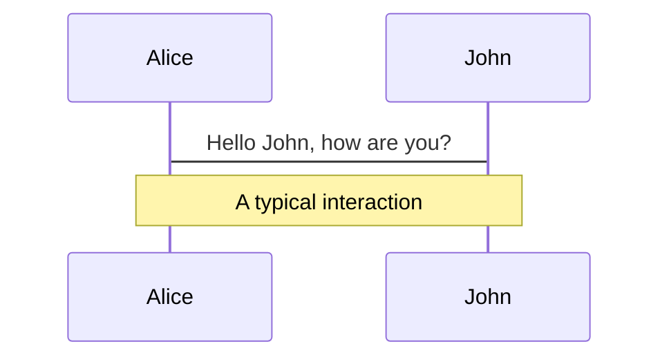
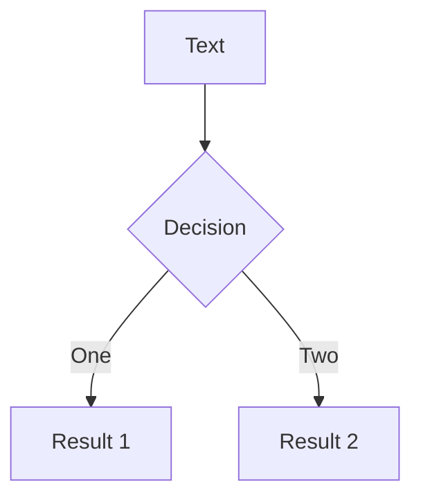
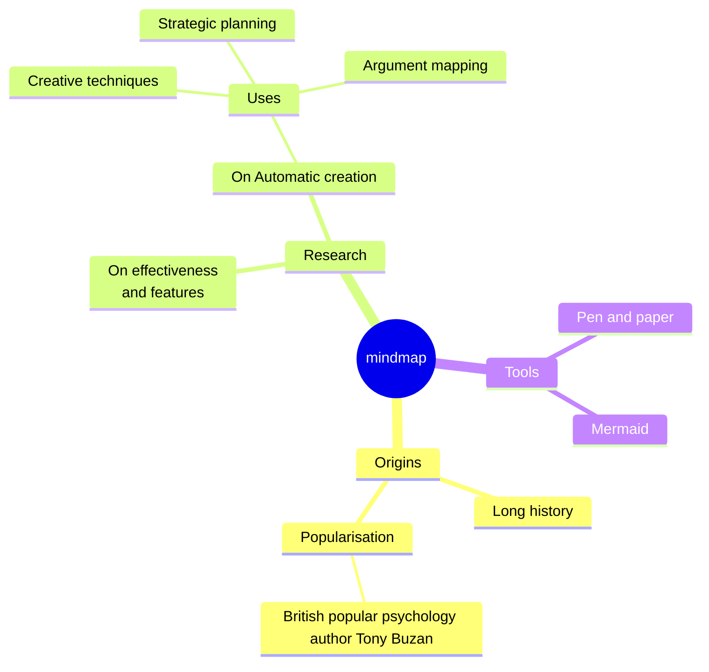
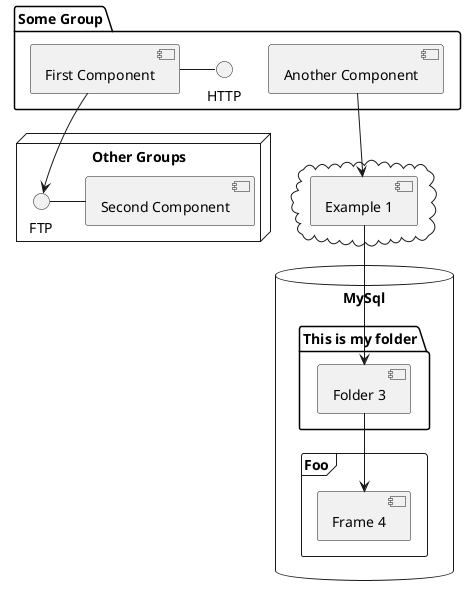

# Python Code Smells

Dealing with dictionaries


<div class="abs-br m-6 text-xl">
  <button @click="$slidev.nav.openInEditor" title="Open in Editor" class="slidev-icon-btn">
    <carbon:edit />
  </button>
  <a href="https://github.com/slidevjs/slidev" target="_blank" class="slidev-icon-btn">
    <carbon:logo-github />
  </a>
</div>

<!--
The last comment block of each slide will be treated as slide notes. It will be visible and editable in Presenter Mode along with the slide. [Read more in the docs](https://sli.dev/guide/syntax.html#notes)
-->

---
transition: fade-out
---

# What is a dictionary?

An inbuilt, iterable, mutable datatype in Python that allows programmers to map hashable values to arbitrary objects

```python
example_dictionary = {
  "first_key": "first_value",
  "second_key": "second_value"
}
```

<br>
<br>
<br>
<br>

# What is a code smell?

A surface-level indicator in the source code that suggests deeper problems in maintainability.


---
transition: slide-up
level: 2
---

# Code smell 1: Unintended side effects

A side effect occurs when an operation impacts something beyond its primary task

````md magic-move {lines: true}
```python {*|1-4|6-9|11-14|16-20|11-16}
def get_user():
  return {
    user_id: 1
  }

def get_user_score():
  return {
    score: 30
  }

def get_user_with_user_score(user, user_score):
  user = get_user()
  user_score = get_user_score()
  ...

def main():
  user = get_user()
  user_score = get_user_score()
  user_with_user_score = get_user_with_user_score(user, user_score)
  return user_with_user_score
```

```python {11-13}
def get_user():
  return {
    user_id: 1
  }

def get_user_score():
  return {
    score: 30
  }

def get_user_with_user_score(user, user_score):
  user["score"] = user_score["score"]
  return user

def main():
  user = get_user()
  user_score = get_user_score()
  user_with_user_score = get_user_with_user_score(user, user_score)
  return user_with_user_score
```

```python {11-13}
def get_user():
  return {
    user_id: 1
  }

def get_user_score():
  return {
    score: 30
  }

def get_user_with_user_score(user, user_score):
  user["score"] = user_score if "score" in user_score else None
  return user

def main():
  user = get_user()
  user_score = get_user_score()
  user_with_user_score = get_user_with_user_score(user, user_score)
  return user_with_user_score
```

```python {11-13}
def get_user():
  return {
    user_id: 1
  }

def get_user_score():
  return {
    score: 30
  }

def get_user_with_user_score(user, user_score):
  user["score"] = user_score.get("score")
  return user

def main():
  user = get_user()
  user_score = get_user_score()
  user_with_user_score = get_user_with_user_score(user, user_score)
  return user_with_user_score
```

```python {11-13,16,18}
def get_user():
  return {
    user_id: 1
  }

def get_user_score():
  return {
    score: 30
  }

def get_user_with_user_score(user, user_score):
  user["score"] = user_score.get("score")
  return user

def main():
  user = get_user() 
  user_score = get_user_score()
  user_with_user_score = get_user_with_user_score(user, user_score)
  return user_with_user_score
```

```python {*}
import copy


def get_user_with_user_score(user, user_score):
  user = get_user()
  result = user.copy()

  user_score = get_user_score()
  result["score"] = user_score["score"]
  return result
  

def main():
  user = get_user()
  user_score = get_user_score()
  user_with_user_score = get_user_with_user_score(user, user_score)
  return user_with_user_score
```

```python {*}
def get_user_with_user_score(user, user_score):
  result = {}
  user = get_user()
  user_score = get_user_score()

  result["user_id"] = user["user_id"]
  result["score"] = user_score["score"]
  return result
  

def main():
  user = get_user()
  user_score = get_user_score()
  user_with_user_score = get_user_with_user_score(user, user_score)
  return user_with_user_score
```

```python {*}
def get_user_with_user_score(user, user_score):
  result = {}
  user = get_user()
  user_score = get_user_score()

  return {
    "user_id": user["user_id"]
    "score": user_score["score"]
  }
  

def main():
  user = get_user()
  user_score = get_user_score()
  user_with_user_score = get_user_with_user_score(user, user_score)
  return user_with_user_score
```

```python {*}
def get_user_with_user_score(user, user_score):
  user = get_user()
  user_score = get_user_score()
  return {
    **user,
    **user_score
  }

def main():
  user = get_user()
  user_score = get_user_score()
  user_with_user_score = get_user_with_user_score(user, user_score)
  return user_with_user_score
```
````


---
transition: slide-up
level: 2
---

# Code smell 2: Anti-pattern

A common response to a recurring problem that is usually ineffective and risks being highly counterproductive

````md magic-move {lines: true}
```python {*}
def get_user():
  return { user_id: 1 }

def get_user_statistics():
  # No statistics if user has not started playing at least 1 game
  return {
    "games_played": 7,
    "score": 100,
    "kill_streak": 2,
    "total_enemies_killed": 58,
    "favourite_gun": "M16"
  }

def get_user_with_user_statistics(user, user_statistics):
  # If no user statistics is available, return None for all values
  ...

```

```python
def get_user_with_user_statistics(user, user_statistics):
  # If no user statistics is available, return None for all values
  user = get_user()
  statistics = get_user_statistics()
  return {
    "user_id": user["user_id"],
    "games_played": (
        statistics["games_played"] 
        if "games_played" in statistics else 0
    ),
    "score": statistics["score"] 
        if "score" in statistics else 0,
    "kill_streak": statistics["kill_streak"] 
        if "kill_streak" in statistics else 0,
    "total_enemies_killed": (
        statistics["total_enemies_killed"]
        if "total_enemies_killed" in statistics else 0
    ),
    "faviourite_gun": (
        statistics["faviourite_gun"] 
        if "faviourite_gun" in statistics else None
    ),
  }
```
```python
def get_user_with_user_statistics(user, user_statistics):
  # If no user statistics is available, return None for all values
  user = get_user()
  statistics = get_user_statistics()
  return {
      "user_id": user["user_id"],
      "games_played": statistics.get("games_played", 0),
      "score": statistics.get("score", 0),
      "kill_streak": statistics.get("kill_streak", 0),
      "total_enemies_killed": statistics.get("total_enemies_killed", 0),
      "favourite_gun": statistics.get("favourite_gun", None)
  }
```
```python {6-11}
def get_user_with_user_statistics(user, user_statistics):
  # If no user statistics is available, return None for all values
  user = get_user()
  statistics = get_user_statistics()
  return {
      "user_id": user["user_id"],
      "games_played": statistics.get("games_played", 0),
      "score": statistics.get("score", 0),
      "kill_streak": statistics.get("kill_streak", 0),
      "total_enemies_killed": statistics.get("total_enemies_killed", 0),
      "favourite_gun": statistics.get("favourite_gun", None)
  }
```
````


---
transition: slide-up
level: 2
---

# The problem with Dictionaries

Dictionaries are opaque data structures!

Other languages deal with this problem through the use of:
 - Structs (C, Golang)
 - Interfaces (Typescript)
 - Classes (Java)


---
transition: slide-up
level: 2
---

# Dataclasses

````md magic-move {lines: true}
```python {*}
poker_card = {
  "value": 8,
  "suit": "H"
}

class Card:
  def __init__(self, value: int, suit: str):
      self.value = value
      self.suit = suit

poker_card_class = Card(**poker_card)
```
```python {6-12}
poker_card = {
  "value": 8,
  "suit": "H"
}

class Card:
  def __init__(self, value: int, suit: str):
      self.value = value
      self.suit = suit

poker_card_class = Card(**poker_card)
# <__main__.Card object at 0x7f8ac6d117d0>
```

```python {6-15}
poker_card = {
  "value": 8,
  "suit": "H"
}

class Card:
  def __init__(self, value: int, suit: str):
      self.value = value
      self.suit = suit

  def __str__(self) -> str:
    return f"{self.value} of {self.suit}"

poker_card_class = Card(**poker_card)
# 8 of H
```

```python {6-20}
poker_card = {
  "value": 8,
  "suit": "H"
}

class Card:
  def __init__(self, value: int, suit: str):
      self.value = value
      self.suit = suit

  def __str__(self) -> str:
    return f"{self.value} of {self.suit}"

  def __eq__(self, other) -> bool:
    if self.value != other.value or self.suit != other.suit:
        return False
    return True

poker_card_class = Card(**poker_card)
# 8 of H
```

```python {1,9-12}
from dataclasses import dataclass


poker_card = {
  "value": 8,
  "suit": "H"
}

@dataclass
class Card:
  value: int
  suit: str

poker_card_class = Card(**poker_card)
# Card(value=8, suit='H')
```
````


---
level: 2
---

# Advantages of using Dataclasses

1. 🧩 **Type Safety (Limited)** - Leverages type annotations to ensure better code reliability and catch potential type-related errors during development.

2. 🛠️ **Automatic Method Generation** - Automatically generates essential methods like __init__, __repr__, and __eq__, saving time and reducing boilerplate code.

3. ✍️ **Simplified Syntax** - With the @dataclass decorator, defining classes becomes cleaner and more concise compared to manually writing initialization and utility methods.

4. 🔒 **Immutability** - By setting `frozen=True`, you can create immutable objects, ensuring the instance cannot be modified after creation.

---
transition: slide-up
level: 2
---

# Code smell 2: Anti-pattern - (Refactored)

A common response to a recurring problem that is usually ineffective and risks being highly counterproductive

````md magic-move {lines: true}
```python
def get_user_with_user_statistics(user, user_statistics):
  # If no user statistics is available, return None for all values
  user = get_user()
  statistics = get_user_statistics()
  return {
      "user_id": user["user_id"],
      "games_played": statistics.get("games_played", 0),
      "score": statistics.get("score", 0),
      "kill_streak": statistics.get("kill_streak", 0),
      "total_enemies_killed": statistics.get("total_enemies_killed", 0),
      "favourite_gun": statistics.get("favourite_gun", None)
  }
```
```python
from dataclasses import dataclass
from typing import Optional

@dataclass
class UserWithUserStatistics:
  user_id: int
  games_played: int = 0
  score: int = 0
  kill_streak: int = 0
  total_enemies_killed: int = 0
  faviourite_gun: Optional[str] = None


def get_user_with_user_statistics(user, user_statistics):
  # If no user statistics is available, return None for all values
  user = get_user()
  statistics = get_user_statistics()
  return UserWithUserStatistics(**user, **statistics)
```

```python
from dataclasses import dataclass
from typing import Optional

@dataclass
class UserWithUserStatistics:
  user_id: int
  games_played: int = 0
  score: int = 0
  kill_streak: int = 0
  total_enemies_killed: int = 0
  faviourite_gun: Optional[str] = None


def get_user_with_user_statistics(user: dict, user_statistics: dict) -> UserWithUserStatistics:
  # If no user statistics is available, return None for all values
  user = get_user()
  statistics = get_user_statistics()
  return UserWithUserStatistics(**user, **statistics)
```
````


---
transition: slide-up
level: 2
---

# The problem with Dataclasses

````md magic-move {lines: true}
```python
# No in-built data validation

poker_card = {
  "value": 8,
  "suit": "H"
}

@dataclass
class Card:
  value: int
  suit: str

poker_card_class = Card(**poker_card)
```
```python
# No in-built data validation
from dataclasses import dataclass

poker_card = {
  "value": "8",
  "suit": 39
}

class InvalidCardValueException(Exception):
    pass

class InvalidCardSuitException(Exception):
    pass

@dataclass
class Card:
  value: int
  suit: str

  def __post_init__(self):
    if not isinstance(self.value, int):
        raise InvalidCardValueException
    if not isinstance(self.value, str):
        raise InvalidCardSuitException
```
````

---
transition: slide-up
level: 2
---

# Pydantic

````md magic-move {lines: true}
```python
from dataclasses import dataclass

poker_card = {
  "value": "8",
  "suit": 39
}

class InvalidCardValueException(Exception):
    pass

class InvalidCardSuitException(Exception):
    pass

@dataclass
class Card:
  value: int
  suit: str

  def __post_init__(self):
    if not isinstance(self.value, int):
        raise InvalidCardValueException
    if not isinstance(self.value, str):
        raise InvalidCardSuitException
```
```python
from pydantic import BaseModel

poker_card = {
  "value": "8",
  "suit": 39
}

class Card(BaseModel):
  value: int
  suit: str
```
````

---

# Components

<table>
  <thead>
      <tr>
          <th>Feature</th>
          <th>Dictionary</th>
          <th>Class</th>
          <th>Dataclass</th>
          <th>Pydantic</th>
      </tr>
  </thead>
  <tbody>
      <tr>
          <td>Python standard library</td>
          <td class="checkmark">✔</td>
          <td class="checkmark">✔</td>
          <td class="checkmark">✔ (v3.7)</td>
          <td></td>
      </tr>
      <tr>
          <td>Type checking</td>
          <td></td>
          <td></td>
          <td></td>
          <td class="checkmark">✔</td>
      </tr>
      <tr>
          <td>Default values</td>
          <td></td>
          <td class="checkmark">✔</td>
          <td class="checkmark">✔</td>
          <td class="checkmark">✔</td>
      </tr>
      <tr>
          <td>Validation</td>
          <td></td>
          <td></td>
          <td></td>
          <td class="checkmark">✔</td>
      </tr>
      <tr>
          <td>Serialization support</td>
          <td></td>
          <td></td>
          <td class="checkmark">✔</td>
          <td class="checkmark">✔</td>
      </tr>
      <tr>
          <td>Immutability support</td>
          <td></td>
          <td></td>
          <td class="checkmark">✔</td>
          <td class="checkmark">✔</td>
      </tr>
  </tbody>
</table>


---
class: px-20
---

# Themes

Slidev comes with powerful theming support. Themes can provide styles, layouts, components, or even configurations for tools. Switching between themes by just **one edit** in your frontmatter:

<div grid="~ cols-2 gap-2" m="t-2">

```yaml
---
theme: default
---
```

```yaml
---
theme: seriph
---
```


</div>

Read more about [How to use a theme](https://sli.dev/guide/theme-addon#use-theme) and
check out the [Awesome Themes Gallery](https://sli.dev/resources/theme-gallery).

---

# Clicks Animations

You can add `v-click` to elements to add a click animation.

<div v-click>

This shows up when you click the slide:

```html
<div v-click>This shows up when you click the slide.</div>
```

</div>

<br>

<v-click>

The <span v-mark.red="3"><code>v-mark</code> directive</span>
also allows you to add
<span v-mark.circle.orange="4">inline marks</span>
, powered by [Rough Notation](https://roughnotation.com/):

```html
<span v-mark.underline.orange>inline markers</span>
```

</v-click>

<div mt-20 v-click>

[Learn more](https://sli.dev/guide/animations#click-animation)

</div>

---

# Motions

Motion animations are powered by [@vueuse/motion](https://motion.vueuse.org/), triggered by `v-motion` directive.

```html
<div
  v-motion
  :initial="{ x: -80 }"
  :enter="{ x: 0 }"
  :click-3="{ x: 80 }"
  :leave="{ x: 1000 }"
>
  Slidev
</div>
```

<div class="w-60 relative">
  <div class="relative w-40 h-40">
    
    
    
  </div>

  <div
    class="text-5xl absolute top-14 left-40 text-[#2B90B6] -z-1"
    v-motion
    :initial="{ x: -80, opacity: 0}"
    :enter="{ x: 0, opacity: 1, transition: { delay: 2000, duration: 1000 } }">
    Slidev
  </div>
</div>

<!-- vue script setup scripts can be directly used in markdown, and will only affects current page -->
<script setup lang="ts">
const final = {
  x: 0,
  y: 0,
  rotate: 0,
  scale: 1,
  transition: {
    type: 'spring',
    damping: 10,
    stiffness: 20,
    mass: 2
  }
}
</script>

<div
  v-motion
  :initial="{ x:35, y: 30, opacity: 0}"
  :enter="{ y: 0, opacity: 1, transition: { delay: 3500 } }">

[Learn more](https://sli.dev/guide/animations.html#motion)

</div>

---

# LaTeX

LaTeX is supported out-of-box. Powered by [KaTeX](https://katex.org/).

<div h-3 />

Inline $\sqrt{3x-1}+(1+x)^2$

Block
$$ {1|3|all}
\begin{aligned}
\nabla \cdot \vec{E} &= \frac{\rho}{\varepsilon_0} \\
\nabla \cdot \vec{B} &= 0 \\
\nabla \times \vec{E} &= -\frac{\partial\vec{B}}{\partial t} \\
\nabla \times \vec{B} &= \mu_0\vec{J} + \mu_0\varepsilon_0\frac{\partial\vec{E}}{\partial t}
\end{aligned}
$$

[Learn more](https://sli.dev/features/latex)

---

# Diagrams

You can create diagrams / graphs from textual descriptions, directly in your Markdown.

<div class="grid grid-cols-4 gap-5 pt-4 -mb-6">









</div>

Learn more: [Mermaid Diagrams](https://sli.dev/features/mermaid) and [PlantUML Diagrams](https://sli.dev/features/plantuml)

---
foo: bar
dragPos:
  square: 0,-51,0,0
---

# Draggable Elements

Double-click on the draggable elements to edit their positions.

<br>

###### Directive Usage

```md

```

<br>

###### Component Usage

```md
<v-drag text-3xl>
  <div class="i-carbon:arrow-up" />
  Use the `v-drag` component to have a draggable container!
</v-drag>
```

<v-drag pos="663,206,261,_,-15">
  <div text-center text-3xl border border-main rounded>
    Double-click me!
  </div>
</v-drag>


###### Draggable Arrow

```md
<v-drag-arrow two-way />
```

<v-drag-arrow pos="67,452,253,46" two-way op70 />

---
src: ./pages/imported-slides.md
hide: false
---

---

# Monaco Editor

Slidev provides built-in Monaco Editor support.

Add `{monaco}` to the code block to turn it into an editor:

```ts {monaco}
import { ref } from 'vue'
import { emptyArray } from './external'

const arr = ref(emptyArray(10))
```

Use `{monaco-run}` to create an editor that can execute the code directly in the slide:

```ts {monaco-run}
import { version } from 'vue'
import { emptyArray, sayHello } from './external'

sayHello()
console.log(`vue ${version}`)
console.log(emptyArray<number>(10).reduce(fib => [...fib, fib.at(-1)! + fib.at(-2)!], [1, 1]))
```

---
layout: center
class: text-center
---

# Learn More

[Documentation](https://sli.dev) · [GitHub](https://github.com/slidevjs/slidev) · [Showcases](https://sli.dev/resources/showcases)

<PoweredBySlidev mt-10 />
